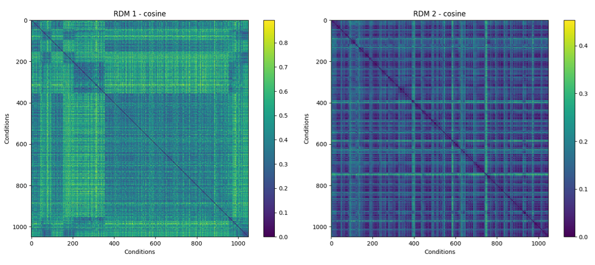
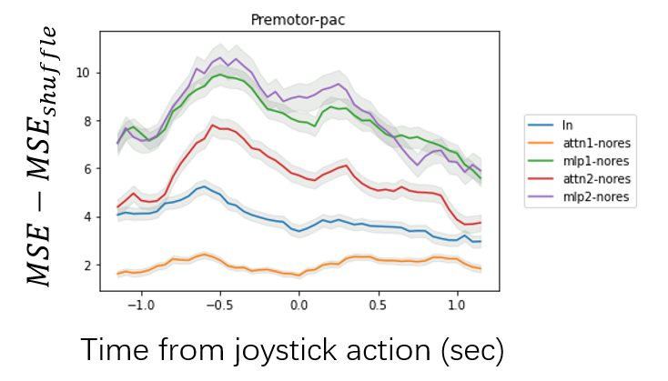

# Brain-Constrained Transformer (Research Vision)

## 📖 Overview

Current AI models predominantly scale performance by increasing parameters, whereas the biological brain accomplishes complex cognitive tasks under severe resource constraints. A key mechanism behind this biological efficiency is the decomposition of complex problems into **modular and hierarchical abstract structures**, which simultaneously conserves resources and enhances processing efficiency.

**This research poses a fundamental question:**
> *Can artificial neural networks (ANNs) spontaneously develop similar modular and hierarchical structures when subjected to analogous resource constraints?*

[cite_start]To answer this, this repository leverages three key experimental resources: a highly structured **Pac-Man paradigm**, an interpretable **Transformer baseline model**, and multi-region **electrophysiological recordings**[cite: 3, 17, 37].

### Key Research Objectives
1.  [cite_start]**Structural Emergence via Constraints:** We implement computationally economical constraint methods to promote structure, including **Differentiable L0 Regularization** [cite: 19][cite_start], **Modified Mixture of Experts (MoE)** [cite: 20][cite_start], and **Hierarchical Convergence Models (HCM)**[cite: 23].
2.  [cite_start]**Brain-AI Alignment:** We hypothesize that constrained models will develop internal representations more aligned with biological neural activity, verified via **Representational Similarity Analysis (RSA)** and **Single-Neuron Encoding Models**[cite: 32, 33].
3.  [cite_start]**Bidirectional Interpretability:** By clustering the model's internal states, we aim to discover data-driven behavioral strategy modules that serve as novel labels to reinterpret primate behavior[cite: 34, 36].

---

## 🏗 Model Architecture

Our baseline model utilizes a pure attention-based architecture to process sequential game states.

### Input Representation
* **Input Data:** The model ingests the two game frames immediately preceding a junction decision.
* **Tensor Shape:** Each frame is represented as a tensor of size $32 \times 28 \times 17$ (maze height $\times$ width $\times$ feature channels).
* **Preprocessing:** Frames are divided into non-overlapping $2 \times 2$ patches.

### The Transformer Encoder
Following the Vision Transformer (ViT) design:
1.  **Patch Projection:** Each patch is flattened and projected into a $d$-dimensional embedding space ($d=48$).
2.  **Positional Encoding:** A 2D sinusoidal encoding is added to preserve the spatial layout of the maze.
3.  **CLS Token:** A learnable classification (CLS) token is prepended to the sequence to aggregate global context and produce the final action prediction.
4.  **Encoder Blocks:** We utilize **2 Transformer blocks**, each consisting of:
    * **Multi-Head Attention (2 heads):** Allows the model to learn multiple relational patterns in parallel.
    * **MLP Feedforward Layer:** Processes information locally.

### Performance
* **Current Baseline:** The model achieves **87.664% accuracy** on the test set, demonstrating strong predictive performance in capturing the decision strategy underlying the Pacman task.

---

## 🧠 Preliminary Neural Analysis

We rigorously evaluate the biological plausibility of our model using neural recording data from primates.

### 1. Representational Similarity Analysis (RSA)
We performed RSA between the **MLP2 layer of the Transformer’s CLS token** and the **premotor region** of the biological brain using cosine similarity.

*Figure 1: Representational Dissimilarity Matrices (RDMs) showing the alignment between model internal states and biological neural activity.*

### 2. Linear Decoding & Encoding Models
Different token embeddings were trained to predict activity within specific brain areas.
* **Data:** 4,428 neurons (selected from 7,495 based on firing rate stability) across a 2.3-second window centered on joystick movement.
* **Metric:** Performance is quantified as $MSE - MSE_{shuffle}$ (significance $p < 0.05$).
* **Finding:** The **CLS token** exhibits significantly higher accuracy when predicting neurons in the **Premotor cortex and Frontal Eye Fields (FEF)** compared to other tokens. This indicates that the CLS token effectively encodes the motor signal.

*Figure 2: Decoding performance of different model components over time relative to joystick action.*

---

## 🚀 Roadmap & Future Work

We are currently extending the baseline with three major architectural improvements to test the hypothesis that **resource-constrained models develop more brain-like representations**.

### Phase 1: Differentiable L0 Regularization (Sparse Connectivity)
* **Objective:** Implement a differentiable relaxation of the L0 norm.
* **Goal:** Enable simultaneous optimization of model performance and parameter sparsity within the backpropagation framework.

### Phase 2: Modified Mixture of Experts (MoE) (Sparse Activation)
* **Objective:** Decompose the output layer into modular behavioral units.
* **Mechanism:** Inspired by Schrum & Miikkulainen, each module will have specific policy neurons and a gating unit to regulate information flow.

### Phase 3: Hierarchical Convergence Model (HCM)
* **Objective:** Introduce a dual-speed architecture to solve the "rapid convergence" issue.
    * **Low-level (L) module:** Updates rapidly to reach local equilibrium.
    * **High-level (H) module:** Updates slowly, guiding the L-module via recurrent feedback.
* **Expected Outcome:** Effective layered processing while maintaining global coherence.

### Hypothesis & Expected Impact
1.  **Structural Emergence:** Resource constraints (L0 + MoE + HCM) will induce modular and hierarchical structures automatically.
2.  **Brain-Alignment:** The constrained model will show significantly higher RSA scores with neural data compared to unconstrained models.
3.  **Behavioral Discovery:** Clustering internal states will reveal data-driven "strategy modules," offering novel labels for interpreting primate behavior.

---

## 🛠 Usage

*(Code usage instructions are currently being updated)*

---
*Created by Puzhi Yu*
