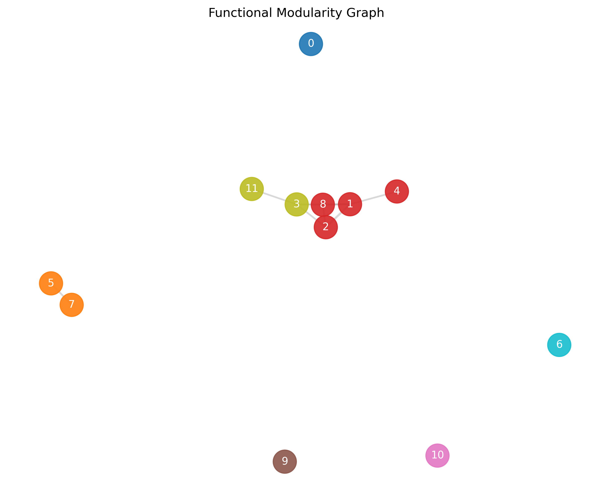
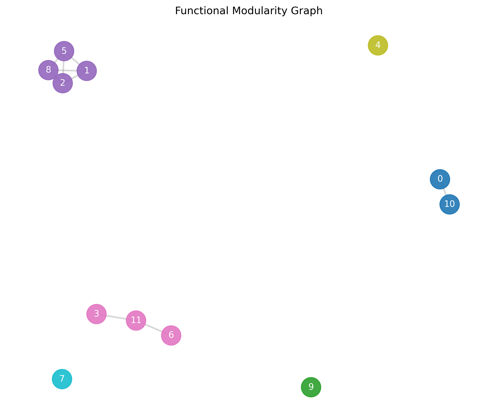
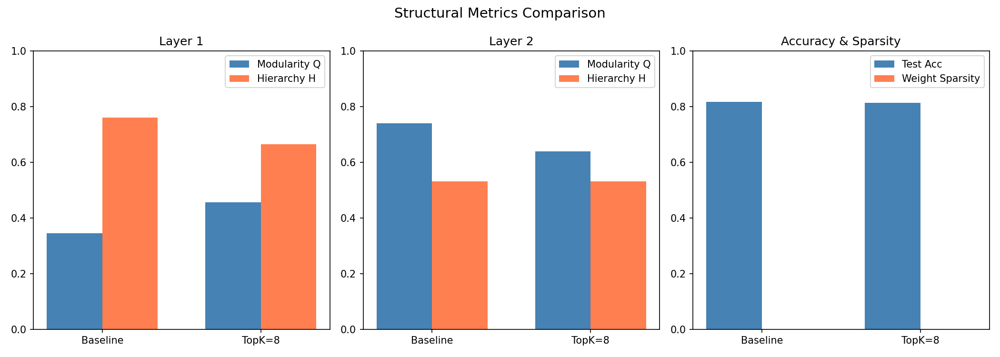
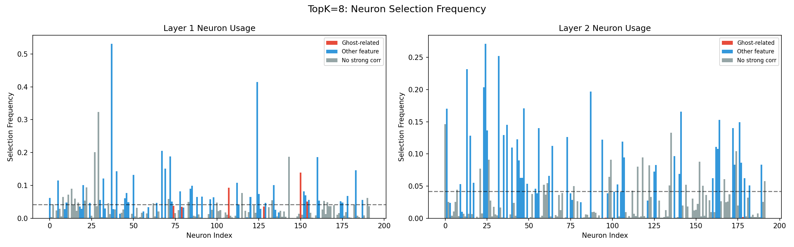
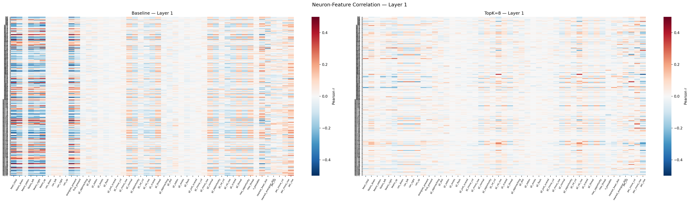
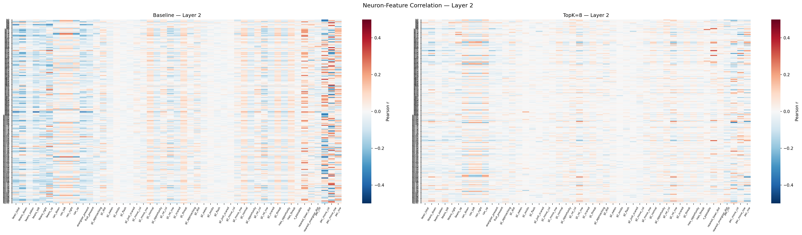
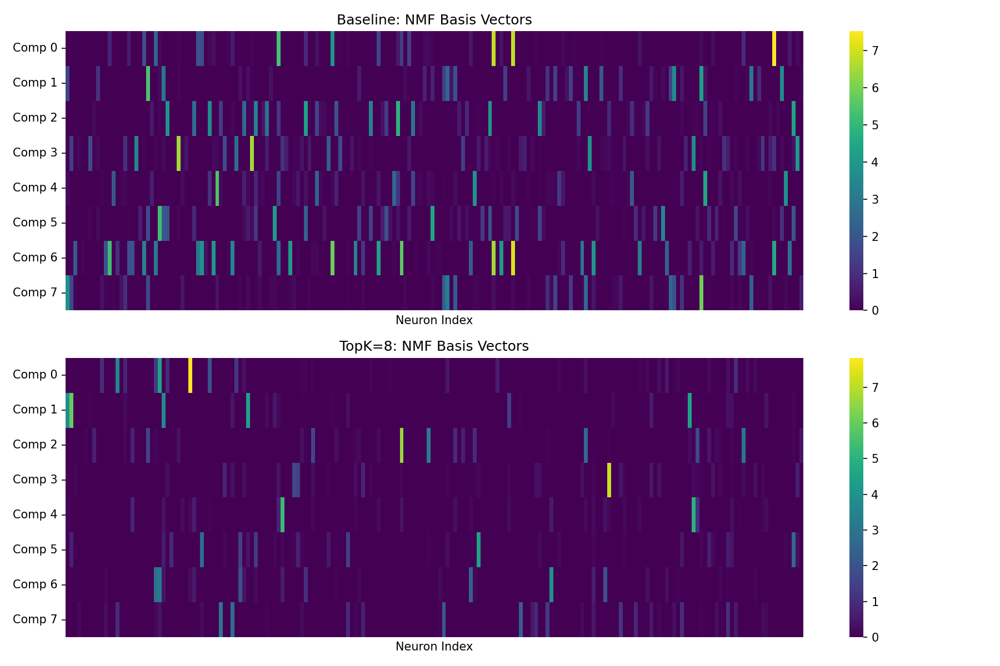
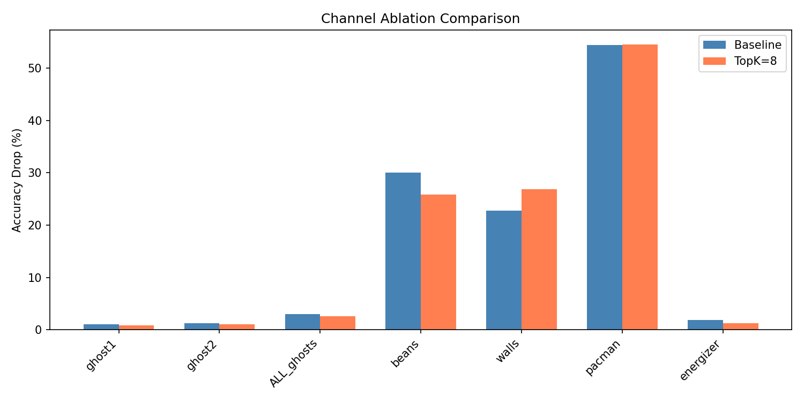

# Brain-Constrained Transformer (Research Vision)

[]()
[]()
[]()

## 📖 Overview

Current AI models predominantly scale performance by increasing parameters, whereas the biological brain accomplishes complex cognitive tasks under severe resource constraints. A key mechanism behind this biological efficiency is the decomposition of complex problems into **modular and hierarchical abstract structures**, which simultaneously conserves resources and enhances processing efficiency.

**This research poses a fundamental question:**
> *Can artificial neural networks (ANNs) spontaneously develop similar modular and hierarchical structures when subjected to analogous resource constraints?*

To answer this, this repository leverages three key experimental resources: a highly structured **Pac-Man paradigm**, an interpretable **Transformer baseline model**, and multi-region **electrophysiological recordings**.

### Key Research Objectives
1.  **Structural Emergence via Constraints:** We implement computationally economical constraint methods to promote structure, including **Differentiable L0 Regularization**, **Modified Mixture of Experts (MoE)**, and **Hierarchical Convergence Models (HCM)**.
2.  **Brain-AI Alignment:** We hypothesize that constrained models will develop internal representations more aligned with biological neural activity, verified via **Representational Similarity Analysis (RSA)** and **Single-Neuron Encoding Models**.
3.  **Bidirectional Interpretability:** By clustering the model's internal states, we aim to discover data-driven behavioral strategy modules that serve as novel labels to reinterpret primate behavior.

> **Note:** This project is currently under active development. The codebase is being refined to support advanced modularity and hierarchical processing.

---

## 🏗 Model Architecture

Our baseline model utilizes a pure attention-based architecture to process sequential game states.

### Input Representation
* **Input Data:** The model ingests the two game frames immediately preceding a junction decision.
* **Tensor Shape:** Each frame is represented as a tensor of size $32 \times 28 \times 17$ (maze height $\times$ width $\times$ feature channels).
* **Preprocessing:** Frames are divided into non-overlapping $2 \times 2$ patches.

### The Transformer Encoder
Following the Vision Transformer (ViT) design:
1.  **Patch Projection:** Each patch is flattened and projected into a $d$-dimensional embedding space ($d=48$).
2.  **Positional Encoding:** A 2D sinusoidal encoding is added to preserve the spatial layout of the maze.
3.  **CLS Token:** A learnable classification (CLS) token is prepended to the sequence to aggregate global context and produce the final action prediction.
4.  **Encoder Blocks:** We utilize **2 Transformer blocks**, each consisting of:
    * **Multi-Head Attention (2 heads):** Allows the model to learn multiple relational patterns in parallel.
    * **MLP Feedforward Layer:** Processes information locally.

### Performance
* **Current Baseline:** The model achieves **87.664% accuracy** on the test set, demonstrating strong predictive performance in capturing the decision strategy underlying the Pacman task.

---

## 🧠 Preliminary Neural Analysis

We rigorously evaluate the biological plausibility of our model using neural recording data from primates.

### 1. Representational Similarity Analysis (RSA)
I performed RSA between the **MLP2 layer of the Transformer’s CLS token** and the **premotor region** of the biological brain using cosine similarity.


*Figure 1: Representational Dissimilarity Matrices (RDMs) showing the alignment between model internal states and biological neural activity.*

### 2. Linear Decoding & Encoding Models
Different token embeddings were trained to predict activity within specific brain areas.
* **Data:** 4,428 neurons (selected from 7,495 based on firing rate stability) across a 2.3-second window centered on joystick movement.
* **Metric:** Performance is quantified as $MSE - MSE_{shuffle}$ (significance $p < 0.05$).
* **Finding:** The **CLS token** exhibits significantly higher accuracy when predicting neurons in the **Premotor cortex and Frontal Eye Fields (FEF)** compared to other tokens. This indicates that the CLS token effectively encodes the motor signal.


*Figure 2: Decoding performance of different model components over time relative to joystick action.*

---

## 🧠 Emergent Functional Structure: Modularity & Hierarchy

To investigate how the model processes game states from perception to decision-making, I analyzed the **functional network topology** of the Transformer's feed-forward layers. I specifically tracked the **CLS Token**, which serves as the information bottleneck for the final action prediction.

### 1. Methodology & Metrics

I construct a connectivity matrix $A$ based on the pairwise Pearson correlation of neuron activations. The network structure is evaluated using two key metrics from complex network theory:

* **Modularity ($Q$ Score):** Measures the degree of functional specialization into distinct neural clusters (modules).
    $$Q = \frac{1}{m}\sum_{ij}\left[A_{ij} - \frac{k_i^{in}k_j^{out}}{m}\right]\sigma_{ci,cj}$$
    *Where $A_{ij}$ is the connection weight, $k$ is the node degree, $m$ is the total edge weight, and $\sigma$ indicates if nodes $i,j$ belong to the same module.*

* **Hierarchy ($H$ Score):** Quantifies the recursive organization and influence heterogeneity of the network.
    $$H = \frac{\sum_{i \in V}[C_R^{max} - C_R(i)]}{N-1}$$
    *Where $C_R(i)$ represents the influence (reachability) of neuron $i$, indicating whether the layer relies on a few "hub" neurons or is democratically organized.*

### 2. Visualization: Topological Evolution

The graphs below illustrate the functional connectivity of the CLS token in Layer 1 vs. Layer 2. Nodes represent neurons, and edges represent strong functional correlations (Top-20%). Colors indicate detected community modules.

| **Layer 1: Information Integration** | **Layer 2: Decision Disentanglement** |
| :---: | :---: |
|  |  |
| *High connectivity with a **Single Super-Cluster**. The model integrates global spatial features into a unified context representation.* | *Structure disperses into **Three Distinct Modules**. The model disentangles the context into orthogonal decision factors (e.g., Combat, Territory, Safety).* |

### 3. Quantitative Analysis

| Metric | Layer 1 (CLS) | Layer 2 (CLS) | Interpretation |
| :--- | :--- | :--- | :--- |
| **Modularity ($Q$)** | **0.8294** | **0.8274** | Consistently high modularity indicates the model maintains specialized "neural experts" throughout processing. |
| **Hierarchy ($H$)** | **0.4545** | **0.4545** | Stable hierarchical control suggests a consistent command structure where specific "hub" neurons coordinate information flow. |

> **Key Insight:** While the quantitative metrics ($Q$ and $H$) remain stable, the **topological structure** undergoes a dramatic shift. 
> 
> * **Layer 1** exhibits a "Hub-and-Spoke" architecture centered around a large core group, suggesting **Context Integration** (merging stone positions, liberties, and shapes).
> * **Layer 2** evolves into a "Multi-Polar" architecture with separated clusters. This suggests **Feature Orthogonalization**, where the model splits the integrated context into independent strategic components (e.g., *Attacking* vs. *Defending* vs. *Territory Expansion*) before the final linear projection to action space.

---

## Resource Limitation Experiments: Results

We systematically tested whether imposing resource constraints on the 48d2h baseline model (2-layer, dim=48, 2 heads, ~44K parameters) induces more modular and specialized internal representations. Two forms of resource limitation were applied:

1. **L1 Weight Sparsity** with proximal gradient descent (lambda in {1e-5, ..., 1e-2})
2. **Top-K Activation Sparsity** retaining only *k* of 192 MLP hidden neurons per forward pass (*k* in {8, 16, 32, 64, 96, 128})

### Summary Table

| | Baseline | TopK-8 | L1 (lambda=5e-4) |
|:---|:---|:---|:---|
| **Test Accuracy** | 81.67% | 81.44% (-0.2%) | 75.13% (-6.5%) |
| **Layer 1 Modularity Q** | 0.35 | 0.46 (+0.11) | 0.54 (+0.19) |
| **Max Ghost \|r\|** | 0.23 | 0.39 (+0.16) | 0.34 (+0.11) |
| **Ghost Neurons (L1, \|r\|>0.2)** | 10 | 8 | 12 |
| **Weight Sparsity** | 0% | 0% | 51.9% |

### Complete Training Results

| Condition | Best Acc (%) | @ Epoch | Final Acc (%) | Total Epochs | MLP Sparsity (%) |
|:---|:---|:---|:---|:---|:---|
| **Baseline** | **81.67** | 54 | 80.43 | 84 | 0.07 |
| L1 lambda=1e-5 | 71.34 | 152 | 71.13 | 182 | 40.67 |
| L1 lambda=5e-5 | 72.64 | 137 | 72.32 | 167 | 44.85 |
| L1 lambda=1e-4 | 74.03 | 84 | 72.73 | 114 | 48.03 |
| **L1 lambda=5e-4** | **75.13** | 153 | 74.58 | 183 | 51.72 |
| L1 lambda=1e-3 | 73.31 | 188 | 72.87 | 218 | 55.41 |
| L1 lambda=1e-2 | 72.32 | 109 | 71.89 | 139 | 82.80 |
| **TopK k=8** | **81.44** | 63 | 80.69 | 93 | 0.05 |
| TopK k=16 | 80.37 | 62 | 79.97 | 92 | 0.08 |
| TopK k=32 | 81.15 | 106 | 80.14 | 136 | 0.07 |
| TopK k=64 | 80.23 | 93 | 79.50 | 123 | 0.05 |
| TopK k=96 | 80.78 | 154 | 79.30 | 184 | 0.03 |
| TopK k=128 | 81.27 | 122 | 80.11 | 152 | 0.03 |

### Structural Metrics: Baseline vs. TopK-8

| Metric | Baseline | TopK-8 | Delta |
|:---|:---|:---|:---|
| Test Accuracy | 0.8167 | 0.8144 | -0.0023 |
| **Layer 1 Modularity Q** | 0.3457 | **0.4571** | **+0.1114** |
| Layer 2 Modularity Q | 0.7397 | 0.6392 | -0.1005 |

### Key Findings

**Top-K activation sparsity** (k=8) acts as a "soft routing" mechanism:
* Near-zero accuracy cost (-0.2%)
* Creates winner-take-all neuron selection with a small "core" of heavily-used neurons
* Produces a ghost-specialized neuron (N69) that jointly encodes Pac-Man row position and ghost relative positions (r = 0.39)
* Analogous to biological sparse coding under metabolic constraints

**L1 weight sparsity** acts as a "network pruning" mechanism:
* Substantial accuracy cost (-6.5%)
* Physically removes connections (82.7% weight sparsity at lambda=1e-2)
* Increases modularity more dramatically (+0.19 vs. +0.11)
* Enhances action-related specialization in Layer 2 (|r| up to 0.50)
* Increases inter-cluster ghost-distance diversity, hinting at strategic differentiation

### Comparison Figures

| Structural Metrics | Neuron Usage (TopK-8) |
| :---: | :---: |
|  |  |

| Neuron-Feature Correlation (Layer 1) | Neuron-Feature Correlation (Layer 2) |
| :---: | :---: |
|  |  |

| NMF Decomposition | Channel Ablation |
| :---: | :---: |
|  |  |

### Conclusion

Resource limitation, in the form of Top-K activation sparsity and L1 weight sparsity, promotes functional specialization in a Vision Transformer trained to predict primate Pac-Man behavior. Top-K sparsity (k=8) achieves this with minimal accuracy cost (-0.2%) while producing ghost-specialized neurons and increasing network modularity. L1 sparsity achieves higher modularity (+0.19) but at a larger accuracy cost (-6.5%). These results support the hypothesis that resource constraints can drive neural networks toward more modular, interpretable representations, analogous to the functional specialization observed in biological neural circuits operating under metabolic constraints.

---

## Roadmap & Future Work

We are extending the baseline with additional architectural improvements to further test the hypothesis that **resource-constrained models develop more brain-like representations**.

### Planned Experiments

1. **Causal interventions:** Clamp/ablate specific neurons (e.g., N69 in TopK-8) and measure behavioral changes
2. **Larger models:** Apply TopK/L1 to 64d4h (3-layer) models
3. **Combined constraints:** Apply both L1 and TopK simultaneously
4. **Temporal dynamics:** Analyze sparsification evolution using epoch snapshots
5. **Neural comparison:** Compare resource-limited representations with primate neural recordings via RSA

### Additional Architectural Directions

* **Differentiable L0 Regularization** — Enable simultaneous optimization of performance and parameter sparsity
* **Modified Mixture of Experts (MoE)** — Decompose the output layer into modular behavioral units with gating
* **Hierarchical Convergence Model (HCM)** — Dual-speed architecture with fast low-level and slow high-level modules

---

## Usage

### Training with Resource Limitation

```bash
# Baseline reproduction
python train_resource_limited.py --reg none --layers 2 --dim 48 --heads 2

# L1 regularization
python train_resource_limited.py --reg l1 --lambda_l1 1e-4 --layers 2 --dim 48 --heads 2

# Top-K activation sparsity
python train_resource_limited.py --reg topk --topk_k 8 --layers 2 --dim 48 --heads 2
```

### Analysis

```bash
# Analyze a single model
python analyze_resource_limited.py --model results/model_earlystop.pkl

# Compare baseline vs. TopK
python compare_baseline_topk.py \
  --baseline results_48d2h/..._earlystop.pkl \
  --topk results_48d2h/..._topk8_earlystop.pkl

# Decode strategies from FFN activations
python strategy_decode.py --sessions 140-144
```

### Run Full Experiment Suite

```bash
# All experiments (12d1h model)
python run_all.py

# All experiments (48d2h model)
python run_all_48d2h.py

# Or via shell script
bash run_experiments.sh
```

---
*Created by Puzhi Yu*
