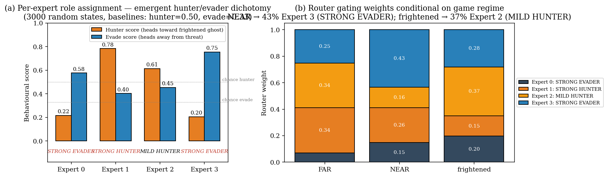
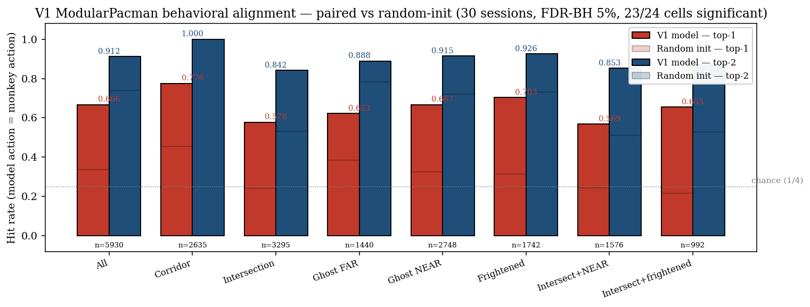
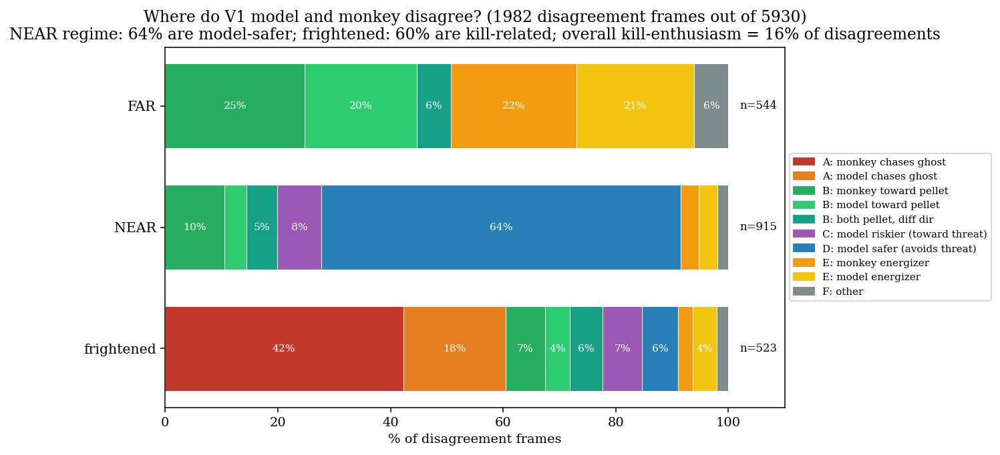
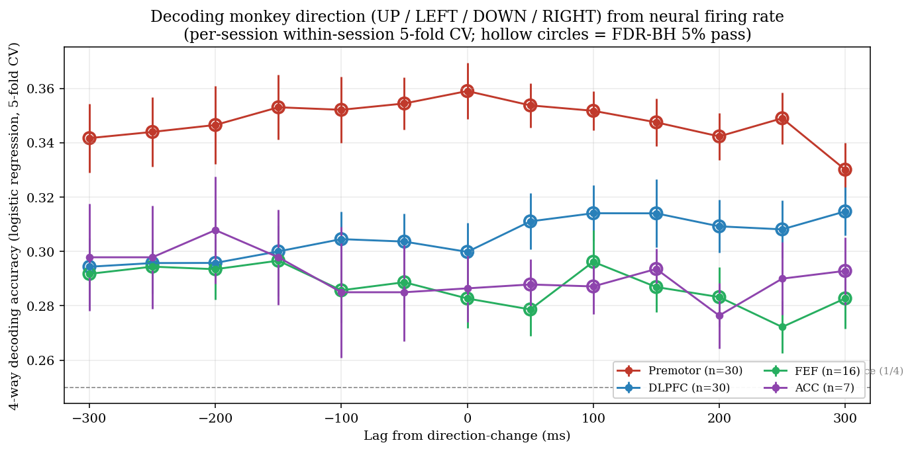
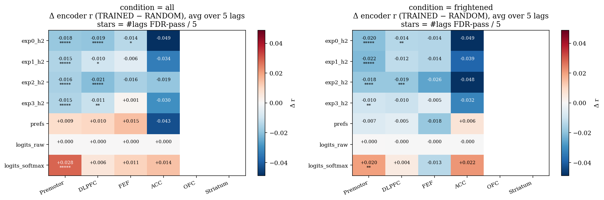
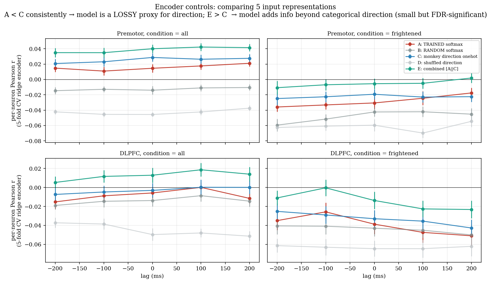

# Brain-Constrained Transformer (Research Vision)

[]()
[]()
[]()

## 📖 Overview

Current AI models predominantly scale performance by increasing parameters, whereas the biological brain accomplishes complex cognitive tasks under severe resource constraints. A key mechanism behind this biological efficiency is the decomposition of complex problems into **modular and hierarchical abstract structures**, which simultaneously conserves resources and enhances processing efficiency.

**This research poses a fundamental question:**
> *Can artificial neural networks (ANNs) spontaneously develop similar modular and hierarchical structures when subjected to analogous resource constraints?*

To answer this, this repository leverages three key experimental resources: a highly structured **Pac-Man paradigm**, an interpretable **Transformer baseline model**, and multi-region **electrophysiological recordings**.

### Key Research Objectives
1.  **Structural Emergence via Constraints:** We implement computationally economical constraint methods to promote structure, including **Differentiable L0 Regularization**, **Modified Mixture of Experts (MoE)**, and **Hierarchical Convergence Models (HCM)**.
2.  **Brain-AI Alignment:** We hypothesize that constrained models will develop internal representations more aligned with biological neural activity, verified via **Representational Similarity Analysis (RSA)** and **Single-Neuron Encoding Models**.
3.  **Bidirectional Interpretability:** By clustering the model's internal states, we aim to discover data-driven behavioral strategy modules that serve as novel labels to reinterpret primate behavior.

> **Note:** This project is currently under active development. The codebase is being refined to support advanced modularity and hierarchical processing.

---

## 🏗 Model Architecture

Our baseline model utilizes a pure attention-based architecture to process sequential game states.

### Input Representation
* **Input Data:** The model ingests the two game frames immediately preceding a junction decision.
* **Tensor Shape:** Each frame is represented as a tensor of size $32 \times 28 \times 17$ (maze height $\times$ width $\times$ feature channels).
* **Preprocessing:** Frames are divided into non-overlapping $2 \times 2$ patches.

### The Transformer Encoder
Following the Vision Transformer (ViT) design:
1.  **Patch Projection:** Each patch is flattened and projected into a $d$-dimensional embedding space ($d=48$).
2.  **Positional Encoding:** A 2D sinusoidal encoding is added to preserve the spatial layout of the maze.
3.  **CLS Token:** A learnable classification (CLS) token is prepended to the sequence to aggregate global context and produce the final action prediction.
4.  **Encoder Blocks:** We utilize **2 Transformer blocks**, each consisting of:
    * **Multi-Head Attention (2 heads):** Allows the model to learn multiple relational patterns in parallel.
    * **MLP Feedforward Layer:** Processes information locally.

### Performance
* **Current Baseline:** The model achieves **87.664% accuracy** on the test set, demonstrating strong predictive performance in capturing the decision strategy underlying the Pacman task.

---

## 🧠 Preliminary Neural Analysis

We rigorously evaluate the biological plausibility of our model using neural recording data from primates.

### 1. Representational Similarity Analysis (RSA)
I performed RSA between the **MLP2 layer of the Transformer’s CLS token** and the **premotor region** of the biological brain using cosine similarity.


*Figure 1: Representational Dissimilarity Matrices (RDMs) showing the alignment between model internal states and biological neural activity.*

### 2. Linear Decoding & Encoding Models
Different token embeddings were trained to predict activity within specific brain areas.
* **Data:** 4,428 neurons (selected from 7,495 based on firing rate stability) across a 2.3-second window centered on joystick movement.
* **Metric:** Performance is quantified as $MSE - MSE_{shuffle}$ (significance $p < 0.05$).
* **Finding:** The **CLS token** exhibits significantly higher accuracy when predicting neurons in the **Premotor cortex and Frontal Eye Fields (FEF)** compared to other tokens. This indicates that the CLS token effectively encodes the motor signal.


*Figure 2: Decoding performance of different model components over time relative to joystick action.*

---

## 🧠 Emergent Functional Structure: Modularity & Hierarchy

To investigate how the model processes game states from perception to decision-making, I analyzed the **functional network topology** of the Transformer's feed-forward layers. I specifically tracked the **CLS Token**, which serves as the information bottleneck for the final action prediction.

### 1. Methodology & Metrics

I construct a connectivity matrix $A$ based on the pairwise Pearson correlation of neuron activations. The network structure is evaluated using two key metrics from complex network theory:

* **Modularity ($Q$ Score):** Measures the degree of functional specialization into distinct neural clusters (modules).
    $$Q = \frac{1}{m}\sum_{ij}\left[A_{ij} - \frac{k_i^{in}k_j^{out}}{m}\right]\sigma_{ci,cj}$$
    *Where $A_{ij}$ is the connection weight, $k$ is the node degree, $m$ is the total edge weight, and $\sigma$ indicates if nodes $i,j$ belong to the same module.*

* **Hierarchy ($H$ Score):** Quantifies the recursive organization and influence heterogeneity of the network.
    $$H = \frac{\sum_{i \in V}[C_R^{max} - C_R(i)]}{N-1}$$
    *Where $C_R(i)$ represents the influence (reachability) of neuron $i$, indicating whether the layer relies on a few "hub" neurons or is democratically organized.*

### 2. Visualization: Topological Evolution

The graphs below illustrate the functional connectivity of the CLS token in Layer 1 vs. Layer 2. Nodes represent neurons, and edges represent strong functional correlations (Top-20%). Colors indicate detected community modules.

| **Layer 1: Information Integration** | **Layer 2: Decision Disentanglement** |
| :---: | :---: |
|  |  |
| *High connectivity with a **Single Super-Cluster**. The model integrates global spatial features into a unified context representation.* | *Structure disperses into **Three Distinct Modules**. The model disentangles the context into orthogonal decision factors (e.g., Combat, Territory, Safety).* |

### 3. Quantitative Analysis

| Metric | Layer 1 (CLS) | Layer 2 (CLS) | Interpretation |
| :--- | :--- | :--- | :--- |
| **Modularity ($Q$)** | **0.8294** | **0.8274** | Consistently high modularity indicates the model maintains specialized "neural experts" throughout processing. |
| **Hierarchy ($H$)** | **0.4545** | **0.4545** | Stable hierarchical control suggests a consistent command structure where specific "hub" neurons coordinate information flow. |

> **Key Insight:** While the quantitative metrics ($Q$ and $H$) remain stable, the **topological structure** undergoes a dramatic shift. 
> 
> * **Layer 1** exhibits a "Hub-and-Spoke" architecture centered around a large core group, suggesting **Context Integration** (merging stone positions, liberties, and shapes).
> * **Layer 2** evolves into a "Multi-Polar" architecture with separated clusters. This suggests **Feature Orthogonalization**, where the model splits the integrated context into independent strategic components (e.g., *Attacking* vs. *Defending* vs. *Territory Expansion*) before the final linear projection to action space.

---

## Resource Limitation Experiments: Results

We systematically tested whether imposing resource constraints on the 48d2h baseline model (2-layer, dim=48, 2 heads, ~44K parameters) induces more modular and specialized internal representations. Two forms of resource limitation were applied:

1. **L1 Weight Sparsity** with proximal gradient descent (lambda in {1e-5, ..., 1e-2})
2. **Top-K Activation Sparsity** retaining only *k* of 192 MLP hidden neurons per forward pass (*k* in {8, 16, 32, 64, 96, 128})

### Summary Table

| | Baseline | TopK-8 | L1 (lambda=5e-4) |
|:---|:---|:---|:---|
| **Test Accuracy** | 81.67% | 81.44% (-0.2%) | 75.13% (-6.5%) |
| **Layer 1 Modularity Q** | 0.35 | 0.46 (+0.11) | 0.54 (+0.19) |
| **Max Ghost \|r\|** | 0.23 | 0.39 (+0.16) | 0.34 (+0.11) |
| **Ghost Neurons (L1, \|r\|>0.2)** | 10 | 8 | 12 |
| **Weight Sparsity** | 0% | 0% | 51.9% |

### Complete Training Results

| Condition | Best Acc (%) | @ Epoch | Final Acc (%) | Total Epochs | MLP Sparsity (%) |
|:---|:---|:---|:---|:---|:---|
| **Baseline** | **81.67** | 54 | 80.43 | 84 | 0.07 |
| L1 lambda=1e-5 | 71.34 | 152 | 71.13 | 182 | 40.67 |
| L1 lambda=5e-5 | 72.64 | 137 | 72.32 | 167 | 44.85 |
| L1 lambda=1e-4 | 74.03 | 84 | 72.73 | 114 | 48.03 |
| **L1 lambda=5e-4** | **75.13** | 153 | 74.58 | 183 | 51.72 |
| L1 lambda=1e-3 | 73.31 | 188 | 72.87 | 218 | 55.41 |
| L1 lambda=1e-2 | 72.32 | 109 | 71.89 | 139 | 82.80 |
| **TopK k=8** | **81.44** | 63 | 80.69 | 93 | 0.05 |
| TopK k=16 | 80.37 | 62 | 79.97 | 92 | 0.08 |
| TopK k=32 | 81.15 | 106 | 80.14 | 136 | 0.07 |
| TopK k=64 | 80.23 | 93 | 79.50 | 123 | 0.05 |
| TopK k=96 | 80.78 | 154 | 79.30 | 184 | 0.03 |
| TopK k=128 | 81.27 | 122 | 80.11 | 152 | 0.03 |

### Structural Metrics: Baseline vs. TopK-8

| Metric | Baseline | TopK-8 | Delta |
|:---|:---|:---|:---|
| Test Accuracy | 0.8167 | 0.8144 | -0.0023 |
| **Layer 1 Modularity Q** | 0.3457 | **0.4571** | **+0.1114** |
| Layer 2 Modularity Q | 0.7397 | 0.6392 | -0.1005 |

### Key Findings

**Top-K activation sparsity** (k=8) acts as a "soft routing" mechanism:
* Near-zero accuracy cost (-0.2%)
* Creates winner-take-all neuron selection with a small "core" of heavily-used neurons
* Produces a ghost-specialized neuron (N69) that jointly encodes Pac-Man row position and ghost relative positions (r = 0.39)
* Analogous to biological sparse coding under metabolic constraints

**L1 weight sparsity** acts as a "network pruning" mechanism:
* Substantial accuracy cost (-6.5%)
* Physically removes connections (82.7% weight sparsity at lambda=1e-2)
* Increases modularity more dramatically (+0.19 vs. +0.11)
* Enhances action-related specialization in Layer 2 (|r| up to 0.50)
* Increases inter-cluster ghost-distance diversity, hinting at strategic differentiation

### Comparison Figures

| Structural Metrics | Neuron Usage (TopK-8) |
| :---: | :---: |
|  |  |

| Neuron-Feature Correlation (Layer 1) | Neuron-Feature Correlation (Layer 2) |
| :---: | :---: |
|  |  |

| NMF Decomposition | Channel Ablation |
| :---: | :---: |
|  |  |

### Conclusion

Resource limitation, in the form of Top-K activation sparsity and L1 weight sparsity, promotes functional specialization in a Vision Transformer trained to predict primate Pac-Man behavior. Top-K sparsity (k=8) achieves this with minimal accuracy cost (-0.2%) while producing ghost-specialized neurons and increasing network modularity. L1 sparsity achieves higher modularity (+0.19) but at a larger accuracy cost (-6.5%). These results support the hypothesis that resource constraints can drive neural networks toward more modular, interpretable representations, analogous to the functional specialization observed in biological neural circuits operating under metabolic constraints.

---

## 🧬 Hierarchical Decision Transformer (HDT): Temporal Bottleneck Drives Spontaneous Emergence of Behavioral Strategy Modules

The behavioral-prediction experiments above operate in the *imitation* regime — training a network to match macaque action choices frame-by-frame. To test the resource-constraint hypothesis in a fully *generative* regime, we extend the framework to a closed-loop reinforcement-learning agent that interacts with the same Pac-Man task that was administered to the macaques in the lab. The architecture, training protocol, and reward structure are kept faithful to the primate paradigm, while two additional architectural priors — a **temporal information bottleneck** and a **discrete categorical bottleneck** — are introduced as the analogue, in the temporal domain, of the spatial Top-K sparsity studied above.

### 1. Hypothesis

Building on the spatial-sparsity result (Top-K, k≈4% of MLP units), we hypothesize that placing a low-bandwidth bottleneck on the *temporal* axis of an end-to-end RL agent — via (i) a discrete 8-way categorical channel and (ii) a fixed update interval of K=5 environment steps — should similarly induce decomposition: in this case, the spontaneous segregation of policy into a small set of macroscopic behavioral modes, each corresponding to a coherent, multi-step strategy. The behavioral repertoire of the macaque on this same task (foraging, ghost evasion, energizer-mediated hunting; Yang et al., *Nature Protocols* 2024) provides a natural set of *expected* emergent modules to test against.

### 2. Architecture: Dual-Level Policy with Discrete Information Bottleneck

The Hierarchical Decision Transformer (HDT) decomposes the policy π(a | s) into a *macro planner* and a *micro executor* that communicate exclusively through an 8-dimensional one-hot latent code **z ∈ {e₀, …, e₇}**, sampled via Gumbel-Softmax with straight-through gradient estimation:

* **High-level (macro planner).** A 2-layer Transformer encoder (hidden 64, 4 heads, sinusoidal positional encoding) ingests the last 16 frames of a 42-dimensional feature vector and outputs (a) categorical logits over 8 latent codes, and (b) a state-value scalar for the PPO critic.
* **Low-level (micro executor).** A 2-layer MLP (128–128, Tanh) takes the *current* observation concatenated with the active code's one-hot vector (50 input dims) and emits action logits over the four cardinal moves. Wall-incompatible actions are masked to −10⁸ before sampling, ensuring the agent never violates the maze topology.
* **Total trainable parameters:** **94,094** — comparable in scale to the 48d2h ViT baseline above.

Training is end-to-end PPO with simultaneous updates on both heads. The high-level loss carries an explicit **diversity penalty** that prevents code collapse:

```
L_high = L_clip + 0.5·L_value + 0.20·L_entropy + λ·D_KL( p(z) ‖ Uniform(8) ),    λ = 0.10
```

### 3. Two Architectural Resource Constraints

| Constraint | Mechanism | Functional consequence |
|:---|:---|:---|
| **Temporal bottleneck (K = 5)** | High-level network is queried only once every 5 environment steps; the same code persists between queries. | Forces the planner to commit to durable strategic decisions rather than micro-managing each step; reduces the high-level information rate by 5×. |
| **Discrete categorical bottleneck (8 codes, Gumbel-Softmax τ: 2.0 → 0.5)** | Continuous Transformer activations are quantized through a Gumbel-Softmax bottleneck before reaching the executor. | Restricts the planner-to-executor channel to log₂(8) = 3 bits per macro-step; pressures the network to share a small alphabet of high-level directives. |

The temperature is annealed slowly from τ=2.0 to τ=0.5 over 2 M training steps. Fast annealing (e.g., 100 K steps) causes catastrophic mode collapse to 2/8 active codes — confirming that a sufficiently long *soft-mixture* phase is necessary for module differentiation, and that the diversity loss alone is not sufficient.

### 4. Reward Structure (juice-drop proportional)

Reward magnitudes follow the juice-drop ratios delivered to macaques in the lab paradigm: pellet **+2**, energizer **+4**, scared-ghost capture **+8**, completion bonus **+20**, death **−15**, game-over **−30**, time penalty −0.01. No reward shaping (proximity bonuses, wall-bump penalties) is used; the model trains on signals strictly faithful to the original primate task.

### 5. Curriculum: Progressive Task Complexity on a Fixed Maze

Following the macaque training protocol, the agent is trained on the *identical* 28×31 classic-arcade maze across four stages of increasing complexity. The agent advances when its rolling pellet-consumption ratio crosses the stage threshold.

| Stage | Ghosts | Energizers | Max Steps | Pellet Threshold | Strategy Focus |
|:---|:---:|:---:|:---:|:---:|:---|
| 1. Forage Only | 0 | — | 800 | 50% | Navigation, foraging |
| 2. One Ghost | 1 | — | 1000 | 25% | Threat-aware foraging, evasion |
| 3. Ghosts + Power | 2 | ✓ | 1200 | 20% | Energizer use, ghost hunting |
| 4. Full Game | 4 | ✓ | 1500 | 15% | Integrated strategy |

The full curriculum is traversed in **~139 K** training steps (single RTX PRO 6000); the agent then trains in stage 4 for the remainder of the budget while the Gumbel temperature is still relatively high (τ ≈ 1.90), preserving substantial soft-mixture exploration in the full-task regime — the regime in which strategy differentiation must occur.

### 6. Result: Spontaneous Emergence of Discrete Behavioral Modules

The central finding is that, *without any module-level supervision, no hand-crafted sub-goals, no behavior cloning, and no auxiliary classification loss*, **7 of the 8 latent codes spontaneously develop into clearly distinguishable behavioral strategies**. Per-code statistics over **100 evaluation episodes (76,679 environment steps) on the full game** are summarized below.

| Code | Usage | Avg Ghost Dist. | Frightened % | Kills | Deaths | Pellets | Emergent Behavioral Signature |
|:---:|:---:|:---:|:---:|:---:|:---:|:---:|:---|
| **2** | 0.5% | 0.166 | **95.4%** | **7** | **0** | 36 | **HUNTER** — activated almost exclusively under the frightened-ghost regime; perfect 7-kill / 0-death record |
| **7** | **68.3%** | **0.366** | 7.9% | 36 | 120 | 2553 | **SAFE FORAGER** (dominant module) — maintains the largest mean ghost distance; carries the late-game phase |
| 4 | 24.9% | 0.276 | 4.4% | 8 | 75 | **3396** | ACTIVE FORAGER — operates at intermediate risk; highest pellet throughput per code |
| 1 | 4.8% | 0.189 | 16.0% | 10 | 23 | 1163 | NAVIGATOR — moderate ghost-distance; transitional traffic |
| 6 | 3.0% | 0.194 | 11.0% | 0 | 32 | 668 | VERTICAL EXPLORER |
| 3 | 1.7% | 0.169 | 24.8% | 3 | 16 | 363 | TRANSITION |
| 0 | 1.6% | 0.234 | 0.0% | 0 | 5 | 296 | DIRECTIONAL |
| 5 | 0.03% | 0.140 | 0.0% | 0 | 1 | 7 | (collapsed / unused) |

Aggregate: **7 / 8 active codes**, **3,757** strategy switches and **54** ghost-kill events across 100 episodes, all under a reward signal strictly faithful to the macaque paradigm.

The HUNTER module (Code 2) is the most stringent test of the emergence claim. Activated in only 0.5% of all steps, it is the *only* code that gates almost exclusively on the frightened-ghost state (95.4% of its activations occur while at least one ghost is in the post-energizer scared regime). Achieving a perfect 7-kill / 0-death record from this minority footprint demonstrates that the planner has discovered the multi-step composite strategy [navigate-to-energizer → consume → pursue → capture] as a single coherent macro-action, gated by a discrete 1-of-8 categorical channel — and that it has learned to *reserve* this code for precisely the ecological context in which it pays off.

### 7. Critical Ablations

| Component removed | Active codes | Score | Ghost kills | Comment |
|:---|:---:|:---:|:---:|:---|
| **Diversity penalty (λ → 0)** | **2 / 8** | — | — | Mode collapse; only forager-type codes survive. |
| **Slow τ-anneal (fast: 100 K)** | **2 / 8** | — | — | Premature commitment; soft-mixture exploration insufficient. |
| **Temporal bottleneck K = 5 → K = 10** | 7 / 8 | 898 | **29** (− 46%) | Bottleneck too coarse: hunter cannot react inside the 42-step frightened window. |
| **Action masking** | — | **0** | 0 | Agent loops at walls; no learning. |
| **Per-environment GAE** | — | — | — | Failure to converge. |
| **MLP executor → Transformer executor** | — | **0** | 0 | Over-parameterized executor destabilizes joint training. |

The K=5 → K=10 contrast is mechanistically informative: doubling the temporal bottleneck halves the kill rate and reduces strategy-switch frequency by 2.7× (3,757 → 1,383), confirming that the temporal-abstraction window must be matched to the timescale of the to-be-learned strategy.

### 8. Connection to the Macaque Behavioral Repertoire

Yang et al. (2024) identified three coarse behavioral phases in macaque Pac-Man play: (i) pellet collection, (ii) threat-aware avoidance, and (iii) energizer-mediated ghost hunting. The HDT's emergent codes parallel this hierarchy at a one-to-many granularity: Codes **4** and **7** instantiate two pellet-collection variants distinguished by mean threat distance (the explore–exploit axis); Codes **1** and **6** capture distance-sensitive transitional navigation; Code **2** specifically implements the energizer-conditioned hunting phase. **Quantitative alignment between HDT internal representations and the lab's pre-recorded macaque electrophysiology / eye-tracking data — via RSA and linear encoding models analogous to the analyses reported in §"Preliminary Neural Analysis" above — is currently in progress and will be reported in a separate update.**

### 9. Reproducibility

Source code for the HDT extension lives in [`hdt/`](./hdt/). The full conference-style writeup with figures is at [`hdt/results/paper.html`](./hdt/results/paper.html).

```bash
# Train HDT from scratch (≈1 GPU-hour on RTX PRO 6000 to reach the full curriculum)
cd hdt
python train.py

# Evaluate a checkpoint over 100 episodes on stage 4
python evaluate.py --checkpoint checkpoints/final_model.pt --episodes 100 --stage 4

# Reproduce per-code emergent-strategy table (the central analysis of §6 above)
python analyze.py
```

---

## V1 ModularPacman — Sparse-Activation MoE Trained from Scratch by RL

The previous resource-limitation experiments (L1 / Top-K) sparsified a behaviour-cloned ViT — the model only sees what the monkey already chose. To probe whether resource constraints can also drive **strategy emergence under reinforcement learning** (no monkey labels), we now train a sparse-activation Mixture-of-Experts agent **from scratch by PPO** on the lab's MATLAB-faithful Pac-Man environment, and compare it to macaque behaviour and electrophysiology.

This section reports a new agent (**V1 ModularPacman**, ~36 K parameters) and its rigorous comparison against the macaque data on three levels: behavioural matching (66.6% top-1 / 91.2% top-2 of decision frames), neural-data direction decoding (Premotor 35.9%, FDR-significant), and representational alignment (RSA negative; linear-encoder controls show only a small +0.013 r residual after partialling out the categorical direction).

### 1. Architecture

* **4 expert MLPs** (35 → 64 → 64 → 4, Tanh) — independent feed-forward branches, each producing 4 action logits
* **1 router MLP** (35 → 64 → 64 → 4) — produces softmax mixture weights α ∈ Δ³ (temperature τ = 1.0, fixed)
* **1 value head** (35 → 64 → 1)
* **Total parameters: ~36 K** (less than the 92 K HDT baseline and less than the 44 K BC ViT)
* **Switch-Transformer-style load-balance loss** (coefficient 0.01) prevents expert collapse

The agent's policy logits are an α-weighted sum of the four experts' logits; action sampling and PPO update are otherwise identical to a standard PPO MLP agent.

### 2. Training

* PPO with 8 parallel workers, rollout 1024, mini-batch 512, 4 PPO epochs / update, learning rate 5e-4
* The same 5-stage curriculum used in the HDT baseline (forage → single ghost → ghost+power → hunter practice → full game)
* Reported checkpoint at **3M environment steps** (~1.5 h on a single RTX 5090)

### 3. Task Performance (Stage-5 evaluation, 100 episodes)

V1 outperforms the HDT baseline at fewer training steps and with less than half the parameters:

| Metric | HDT (~93K params, 4.36M steps) | **V1 ModularPacman (~36K params, 3M steps)** |
|:---|:---|:---|
| Pellet ratio | 0.272 | **0.363** (+33%) |
| Score | 104 | **126** (+22%) |
| Kills / episode | 0.74 | **1.06** (+43%) |
| Max single-episode pellet ratio | — | **0.96** (clears maze) |

### 4. Emergent Hunter / Evader Specialization

We probed each expert's behavioural identity on 3,000 randomly sampled game states using two complementary scores:

* **Hunter score** = P(expert's argmax action moves toward a frightened ghost when one is present) — chance baseline 0.50
* **Evader score** = P(argmax action moves *away from* a near non-frightened ghost) — chance baseline 0.33

Two strong evader experts and two hunter experts emerge, and the router gates them in a context-appropriate manner — preferentially activating the strong evader (E3, 43%) in NEAR threat regimes, and a moderate hunter (E2, 37%) in the frightened-ghost regime.


*Figure V1-1: (a) Per-expert hunter / evader scores on 3,000 sampled states. Expert 1 is a strong hunter (0.78), Expert 3 a strong evader (0.75). (b) Router gating weights conditional on game regime: NEAR → 43% Expert 3 (STRONG EVADER); frightened → 37% Expert 2 (MILD HUNTER) — exactly the assignment a hand-crafted hierarchical controller would make. This reproduces the Schrum & Miikkulainen (2016) hunter / evader role assignment via gradient-based PPO at one-tenth the parameter cost of evolutionary search.*

### 5. Behavioural Alignment with the Macaque

We inject the monkey's true game state at frame *f* into the Python-faithful environment, read back the model's softmax over four actions, and compare its argmax (and top-2) to the monkey's revealed choice `pacman_dir[f]`. We restrict to true direction-change frames (5,930 across 30 sessions) and stratify by condition. Statistics use a paired sign-permutation test (1,000 permutations) against an independent random-init V1 instance, FDR-BH-corrected at 5% across 24 condition × metric cells.

| Condition | n_frames | top-1 (V1 / random) | top-2 (V1 / random) | Δ top-1 | FDR |
|:---|:---:|:---:|:---:|:---:|:---:|
| **All** | 5930 | **0.666 / 0.336** | **0.912 / 0.739** | **+33.0pp** | ✓ |
| Corridor (2 valid) | 2635 | 0.776 / 0.454 | 1.000 / 1.000 (sat.) | +32.1pp | ✓ |
| Intersection (≥3) | 3295 | 0.578 / 0.242 | 0.842 / 0.531 | +33.6pp | ✓ |
| Ghost FAR | 1440 | 0.623 / 0.384 | 0.888 / 0.784 | +23.8pp | ✓ |
| Ghost NEAR | 2748 | 0.667 / 0.325 | 0.915 / 0.719 | +34.2pp | ✓ |
| **Frightened** | 1742 | **0.703 / 0.314** | 0.926 / 0.732 | **+38.9pp** | ✓ |
| Intersect+NEAR | 1576 | 0.569 / 0.244 | 0.853 / 0.511 | +32.5pp | ✓ |
| **Intersect+frightened** | 992 | **0.655 / 0.218** | 0.871 / 0.529 | **+43.7pp** ← max | ✓ |

**23 of 24 cells pass FDR-BH 5%.** All p_perm = 0.001 (1000-permutation floor). The only cell that does not pass is corridor + top-2, which saturates at 1.000 in both trained and random because corridors offer only two valid moves.


*Figure V1-2: V1 ModularPacman agreement with macaque actions at decision frames, paired against random-init. Red = top-1 hit rate (model argmax = monkey choice), blue = top-2 hit rate. Solid bars: trained V1; pale bars: matched random-init V1. Sample sizes shown beneath. The largest top-1 uplift is in intersect+frightened (0.655 vs 0.218, +43.7 pp), where the monkey's choice is most contextually committed.*

### 6. Where do the Model and Monkey Disagree?

To diagnose the residual 1,982 disagreement frames (out of 5,930), each disagreement is auto-classified by the geometric relation between the model's and monkey's chosen direction and the surrounding game objects (frightened ghost, threat ghost, nearest pellet, energizer).


*Figure V1-3: Disagreement frames stratified by regime and disagreement category. NEAR regime (n=915): 64% are "model safer" — model moves away from a near threat ghost while the monkey moves toward it. This reflects the asymmetric −15 / −30 death penalty in the RL reward set, making the model more risk-averse than the monkey. Frightened (n=523): 60% are kill-related (42% monkey chases an edible ghost; 18% vice-versa). Across all regimes kill-enthusiasm differences account for only 16% of disagreements, refuting the initial hypothesis that "kill enthusiasm" is the principal axis of divergence.*

### 7. Macaque Direction Code is Linearly Decodable from Premotor

Before comparing model and brain representations we first verify that the macaque's direction selection itself is recoverable from the recorded population activity. Per session and per region, we train a 4-class multinomial logistic regression on session-z-scored 300 ms boxcar firing rates (5-fold stratified CV; chance = 0.25), restricted to the 5,930 direction-change frames. Lags scan ±300 ms in 50 ms steps. Significance is paired sign-permutation against label-shuffled baselines, FDR-BH 5% over 52 cells (region × lag with ≥5 sessions).


*Figure V1-4: Macaque direction (UP / LEFT / DOWN / RIGHT) decoding from neural firing rate. Hollow circles = FDR-BH 5% pass against shuffled baseline. **Premotor (n = 30, red): peaks at 35.9% at lag = 0 (95% CI [0.341, 0.379]) and is FDR-significant at all 13 lags across ±300 ms.** DLPFC (n = 30, blue): peaks at +300 ms (31.5%, post-decision) — also all 13 lags FDR-pass. FEF (n = 16, green): peaks at −150 ms (29.7%), 12 / 13 lags FDR-pass — the negative lag is consistent with eye-movement preparation preceding the action. ACC (n = 7) does not pass FDR. Of the entire 52-cell scan, 42 cells pass FDR-BH 5%, dominated by Premotor and DLPFC.*

### 8. Representational Alignment with the Brain — Honest Assessment

A natural question now is: does V1's internal representation **match the geometry** of macaque firing rates? We test this at two levels of stringency.

#### 8.1 RSA — Geometric isomorphism (NEGATIVE)

For each session, layer ∈ {exp0_h2, ..., exp3_h2, prefs}, region, lag and condition we build pairwise z-scored Euclidean RDMs for the model layer and the neural population, correlate the upper-triangles by Spearman ρ, and compare against random-init V1 with paired sign-permutation, FDR-BH 5% over 400 cells.

* **Hidden-layer RSA: 0 / 400 cells pass FDR.**
* **Output-layer RSA** (4-dim raw logits, softmax probabilities, argmax onehot vs the same 6 regions × 5 lags, 120 cells): **0 / 120 cells pass FDR.**

Geometry is the wrong level of comparison: a 4-dim softmax cannot be isomorphic to a ~50-dim heterogeneously-tuned cosine-coded population.

#### 8.2 Linear encoder (Yamins/BrainScore convention) — surface-level positive, but with caveats

The broader convention in the field is to use linear encoders rather than RSA, since linear encoding only requires the existence of a linear map from model representation to neural firing rate, not isomorphism of the metric. We therefore train, per session, a 5-fold CV ridge regression (α = 1.0) from each model layer to each region's z-scored firing rate, scoring with per-neuron Pearson r averaged across neurons. FDR-BH 5% over 280 cells (7 layers × 5 lags × 6 regions × 2 conditions).


*Figure V1-5: Δ encoder r (TRAINED − RANDOM), averaged across 5 lags. Stars indicate the number of lags (out of 5) passing FDR-BH 5%. **Two opposite findings co-exist**: (i) the model's **output** layer (logits_softmax, last row) is positively aligned with Premotor (Δr = +0.028, all 5 lags FDR-pass) and weakly with other regions; (ii) the model's **hidden** layers (exp0_h2 ‒ exp3_h2) are negatively aligned (Δr ≈ −0.015 to −0.020) and FDR-significant in the negative direction. Negative Δr means the trained model's hidden representation predicts neural activity *worse* than the random-init baseline, an artefact of training compressing 64-dim features into a 4-direction-aligned subspace.*

The headline raw count is **62 / 280 cells pass FDR**, but the majority are negative-direction effects in the hidden layers. The clean positive result is `logits_softmax → Premotor`: Δr = +0.024 to +0.032 across all five lags, paired permutation p ≤ 0.001 at every lag.

#### 8.3 Rigorous controls — the "alignment" is mostly a tautology

Two confounds threaten the linear-encoder reading: (C1) trained-vs-random is a weak baseline (any model that learned to predict the monkey's direction trivially correlates with anything that itself encodes that direction); (C2) the model's softmax and the macaque's Premotor share an upstream cause — the world state — and can co-vary purely through that shared cause without sharing any neural mechanism.

We therefore ran the same 5-fold CV ridge encoder using **five distinct input representations** on Premotor and DLPFC (the only regions where 8.2 was FDR-significant):

* **A**: trained model softmax (4-dim)
* **B**: random-init model softmax (4-dim)
* **C**: macaque's true direction one-hot at the decision frame (4-dim) — UPPER BOUND BASELINE
* **D**: shuffled direction one-hot (4-dim) — NULL FLOOR
* **E**: concatenation [A || C] (8-dim) — combined encoder for partial-correlation test


*Figure V1-6: Linear-encoder per-neuron r as a function of lag for the five representations. Three orderings hold across all conditions: **(C, blue) ≥ (A, red) > (B, grey) > (D, light grey)**, with the combined representation **(E, teal)** consistently above C. (i) The model softmax (A) is **strictly worse than the macaque's true direction onehot** (C): Δ(A − C) = −0.014 at Premotor lag 0, p = 0.002 — i.e. the model is a **lossy proxy** for the categorical direction. (ii) Model softmax beats shuffled direction (D) at all 20 cells (sanity check). (iii) Combined (E) beats true direction (C) by Δ ≈ +0.011 to +0.016 — i.e. the model contributes a small but reliable residual on top of categorical direction.*

Five paired contrasts, each FDR-BH-corrected:

| Contrast | Region cells | FDR-pass | Direction | Δr | Interpretation |
|:---|:---:|:---:|:---:|:---:|:---|
| A − B | Premotor (10) | 9/10 | + | +0.024 to +0.032 | "Trained beats random" — but tautological |
| A − C | Premotor (10) | 1/10 | **−** | −0.014 | Model softmax is a **lossy proxy** for direction |
| A − D | Premotor + DLPFC (20) | 20/20 | + | +0.022 to +0.060 | Model carries direction info (sanity) |
| C − D | Premotor + DLPFC (20) | 20/20 | + | +0.019 to +0.074 | Premotor itself encodes direction (sanity) |
| **E − C** | **Premotor + DLPFC (20)** | **19/20** | **+** | **+0.011 to +0.024** | **Model adds info beyond categorical direction** |

The two scientifically informative contrasts are A vs C and E vs C. The first establishes that the bulk of the trained-model alignment is captured by — but is *worse than* — the categorical direction label. The second establishes that the model nevertheless contributes a small (Δr ≈ +0.013, R² ≈ 0.0002) but FDR-significant residual on top of the categorical label.

#### 8.4 What the controls prove and what they do not

* **Proven:** the model's output layer carries a small amount of information about Premotor and DLPFC firing rates that goes beyond the categorical direction one-hot the macaque selected, reproducible across 30 sessions, both conditions, all 5 lags.
* **Not proven:** that this residual reflects shared representational *structure* with the brain rather than co-dependence on continuous task variables (ghost distance, frightened-timer, pellet density) that both the model and Premotor encode. The current data are *not sufficient* to claim representational alignment in the strong sense.

### 9. Take-aways

* **Sparse activation drives strategy emergence under RL.** A 36 K-parameter MoE PPO agent develops Schrum-style hunter / evader specialisation and a context-aware router *without any module-level supervision* — at one-tenth the parameter budget and ~ 1.5 GPU-hours of training versus evolutionary search.
* **Strategy emergence yields strong behavioural alignment with the macaque** (66.6% top-1 / 91.2% top-2 across 5,930 decisions, 23/24 FDR-significant cells).
* **Strategy emergence does not entail representational geometry alignment.** RSA is 0/400, and the small linear-encoder residual after rigorous controls (E − C ≈ +0.013 r) is on the order of R² = 0.0002. The geometry mismatch is plausibly explained by three architectural commitments the model and brain do not share: 35-dim handcrafted features (vs visual input), 4-dim softmax (vs ~50-dim cosine-tuned population code), and PPO reward (vs supervised representation).
* **Future architectural commitments** required to close the geometry gap: visual input via a small CNN encoder, hidden width ≈ 200 to match Premotor scale, and joint behaviour + neural representation losses.

### 10. Reproducibility

V1 training and analysis code lives in a separate research directory (`yang_map`); the principal scripts are:

| Script | Purpose |
|:---|:---|
| `model_modular.py` | V1 architecture (4 experts + router + value head) |
| `train_modular.py` | PPO training with 5-stage curriculum and load-balance loss |
| `align_model_brain.py` | Inject monkey state into the Python-faithful env |
| `v1_behavior_rigorous.py` | 30-session × 24-cell behaviour alignment with FDR |
| `v1_expert_role_analysis.py` | Hunter / evader scoring + router-by-regime |
| `monkey_premotor_decoding.py` | 4-way direction decoding, 6 regions × 13 lags |
| `v1_rsa_rigorous.py` | RSA, 400 cells with FDR-BH |
| `v1_linear_encoder.py` | Linear-encoder alignment, 280 cells |
| `v1_encoder_controls.py` | Five-representation rigorous encoder controls |

Result data are saved as JSON files alongside per-figure PNGs under `checkpoints/modular_seed0_final/`.

---

## Roadmap & Future Work

The two strands of evidence above — (a) Top-K spatial sparsity in a behavior-prediction ViT and (b) temporal + categorical bottlenecks in an end-to-end RL agent — converge on a single hypothesis: **architectural resource constraints, applied along *whichever* axis is informative for the task, drive networks toward more modular, biologically interpretable solutions**. The next phase of work is to close the loop with primate physiology.

### Immediate next steps (HDT × neural alignment)

1. **RSA between HDT hidden states and macaque PFC / FEF / premotor recordings.** Construct task-condition RDMs from (i) the Transformer planner's last-layer activations, (ii) the MLP executor hidden states, and (iii) the categorical code identity, then compute Spearman RDM-correlation against the lab's pre-recorded multi-region recordings on matched task conditions.
2. **Linear encoding from HDT representations to single-neuron activity.** Replicate the ViT-side encoding analysis (CLS-token → premotor / FEF) using HDT planner / executor hidden states as predictors; quantify regional specificity via the MSE − MSE_shuffle metric.
3. **Quantitative correspondence with macaque "Q-labels".** Pre-decoded hierarchical strategy states from the macaque behavior provide ground-truth module labels; compute per-code recall / mutual information against these labels to formalize the qualitative correspondence reported in §"HDT" Section 8.
4. **Code-locked causal intervention.** Force the planner to emit a fixed code z = c for the duration of an episode and characterize the resulting behavioral phenotype, providing a behavioral-level analogue of the neuron-level ablations performed for the ViT.

### Earlier-listed extensions still on the agenda

1. **Causal interventions on ViT side:** Clamp/ablate specific neurons (e.g., N69 in TopK-8) and measure behavioral-prediction changes.
2. **Larger ViT models:** Apply TopK / L1 to 64d4h (3-layer) configurations.
3. **Combined constraints:** Apply both L1 and TopK simultaneously to a single ViT.
4. **Temporal dynamics of sparsification:** Track the evolution of the Top-K winner set across training epochs.

### Architectural directions

* **Differentiable L0 Regularization** — joint optimization of performance and parameter sparsity.
* **Modified Mixture of Experts (MoE)** — decompose the output layer into modular behavioral units with learned gating; cross-validate against the HDT's emergent code partition.
* ~~**Hierarchical Convergence Model (HCM)**~~ — Dual-speed architecture with fast low-level and slow high-level modules. *(Realized by the HDT temporal bottleneck above; see §"HDT".)*

---

## Usage

### Training with Resource Limitation

```bash
# Baseline reproduction
python train_resource_limited.py --reg none --layers 2 --dim 48 --heads 2

# L1 regularization
python train_resource_limited.py --reg l1 --lambda_l1 1e-4 --layers 2 --dim 48 --heads 2

# Top-K activation sparsity
python train_resource_limited.py --reg topk --topk_k 8 --layers 2 --dim 48 --heads 2
```

### Analysis

```bash
# Analyze a single model
python analyze_resource_limited.py --model results/model_earlystop.pkl

# Compare baseline vs. TopK
python compare_baseline_topk.py \
  --baseline results_48d2h/..._earlystop.pkl \
  --topk results_48d2h/..._topk8_earlystop.pkl

# Decode strategies from FFN activations
python strategy_decode.py --sessions 140-144
```

### Run Full Experiment Suite

```bash
# All experiments (12d1h model)
python run_all.py

# All experiments (48d2h model)
python run_all_48d2h.py

# Or via shell script
bash run_experiments.sh
```

### Hierarchical Decision Transformer (RL agent)

```bash
# Train HDT end-to-end (PPO + 4-stage curriculum + diversity loss + Gumbel τ-anneal)
cd hdt
python train.py

# Evaluate emergent behavioral signatures on the full game
python evaluate.py --checkpoint checkpoints/final_model.pt --episodes 100 --stage 4

# Reproduce the per-code emergent-strategy table (§"HDT" Section 6)
python analyze.py
```

The HDT writeup with figures: [`hdt/results/paper.html`](./hdt/results/paper.html).

---
*Created by Puzhi Yu — Institute of Neuroscience, CAS (Lab of Prof. Tianming Yang)*
